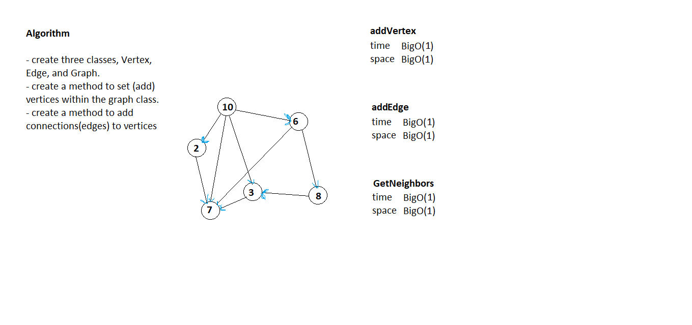
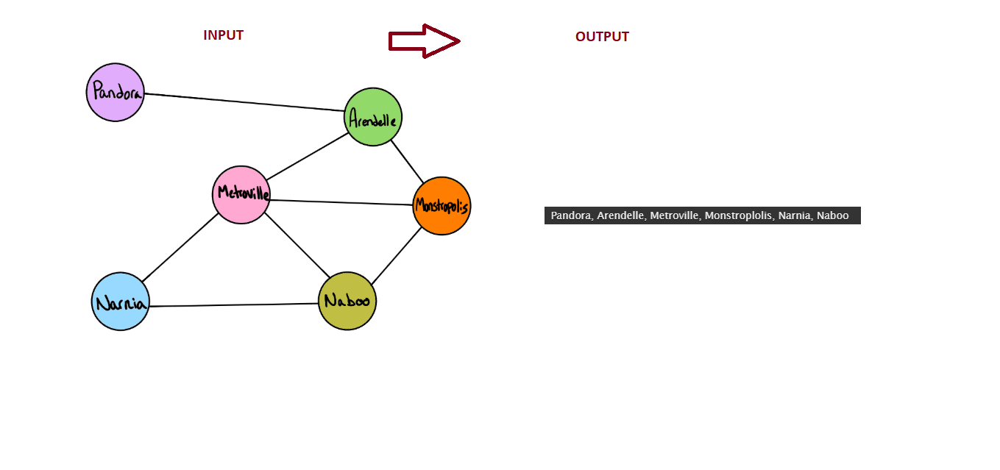

# Code Challenge 35

## Challenge Description
- Implement your own Graph. The graph should be represented as an adjacency list, and should include the following methods:
 - addVertex()
   Adds a new node to the graph
   Takes in the value of that node
   Returns the added node

 - AddEdge()
   Adds a new edge between two nodes in the graph
   Include the ability to have a “weight”
   Takes in the two nodes to be connected by the edge
   Both nodes should already be in the Graph

 - GetNeighbors()
  Returns a collection of edges connected to the given node
  Takes in a given node
  Include the weight of the connection in the returned collection
 
 - GetNodes()
   Returns all of the nodes in the graph as a collection (set, list, or similar)

 - Size()
   Returns the total number of nodes in the graph

## Approach & Efficiency 
- On the whiteboard

### The bigO
- On the whiteboard

## Solution

-----------------------------------------------------------------------------------------------------------------

# Code Challenge 36

## Challenge Description
- Extend your graph object with a breadth-first traversal method that accepts a starting node. Without utilizing any of the built-in methods available to your language, return a collection of nodes in the order they were visited. Display the collection.

<!-- ## Approach & Efficiency 
- On the whiteboard

### The bigO
- On the whiteboard -->

## Solution
