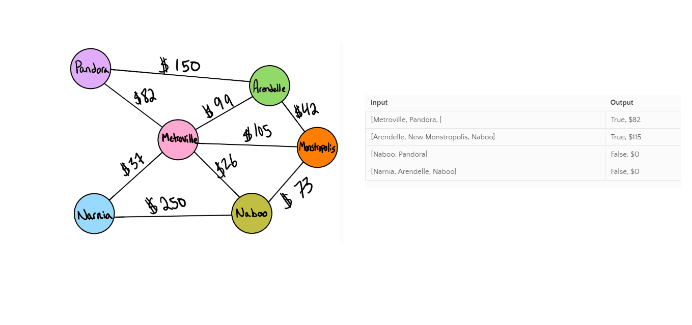

# Code Challenge 37

## Challenge Description
- Write a function based on the specifications above, which takes in a graph, and an array of city names. Without utilizing any of the built-in methods available to your language, return whether the full trip is possible with direct flights, and how much it would cost.

<!-- ## Approach & Efficiency 
- On the whiteboard

### The bigO
- On the whiteboard -->

## Solution
