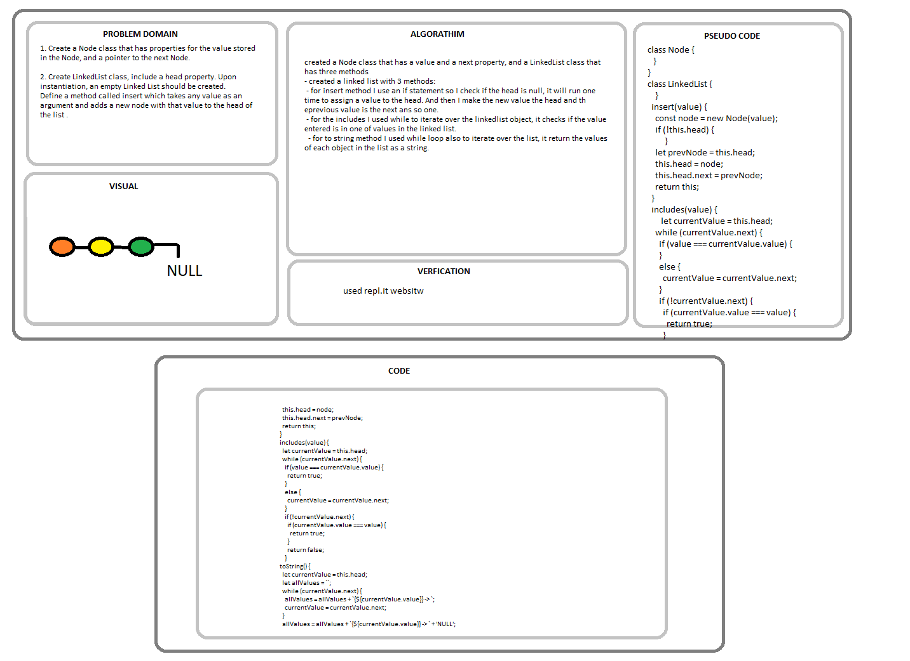
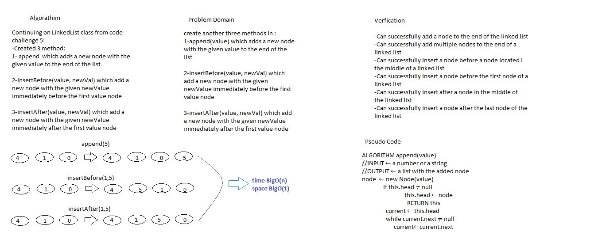

# Singly Linked List
<!-- Short summary or background information -->
- creating singly a linked list.

## Challenge
<!-- Description of the challenge -->
- The challengs is: 
1. Create a Node class that has properties for the value stored in the Node, and a pointer to the next Node.
2. Create LinkedList class, include a head property. Upon instantiation, an empty Linked List should be created.
Define a method called insert which takes any value as an argument and adds a new node with that value to the head of the list with an O(1) Time performance.
Define a method called includes which takes any value as an argument and returns a boolean result depending on whether that value exists as a Node’s value somewhere within the list.
Define a method called toString which takes in no arguments and returns a string representing all the values in the Linked List, formatted as:
"{ a } -> { b } -> { c } -> NULL"

## Approach & Efficiency
<!-- What approach did you take? Why? What is the Big O space/time for this approach? -->
- created a Node class that has a value and a next property, and a LinkedList class that has three methods
- created a linked list with 3 methods:
 - for insert method I use an if statement so I check if the head is null, it will run one time to assign a value to the head. And then I make the new value the head and th eprevious value is the next ans so one.
 - for the includes I used while to iterate over the linkedlist object, it checks if the value entered is in one of values in the linked list.
  - for to string method I used while loop also to iterate over the list, it return the values of each object in the list as a string.

### The bigO of **each method** is BigO(n).

## Whiteboard

-----------------------------------------------------------------------------------------------------------------------

# Code Challenge 6

# Challenge Summary
Creating three methods append, insert before, and insert after

## Challenge Description
- create the following methods for the Linked List class:
- append(value) which adds a new node with the given value to the end of the list
- insertBefore(value, newVal) which add a new node with the given newValue immediately before the first value node
- insertAfter(value, newVal) which add a new node with the given newValue immediately after the first value node

## Approach & Efficiency
- created 3 methods:
- append(value) which adds a new node with the given value to the end of the list
- insertBefore(value, newVal) which add a new node with the given newValue immediately before the first value node
- insertAfter(value, newVal) which add a new node with the given newValue immediately after the first value node

### The bigO of time  for **each method** is BigO(n) and The bigO of space  for **each method** is BigO(1).

## Solution
