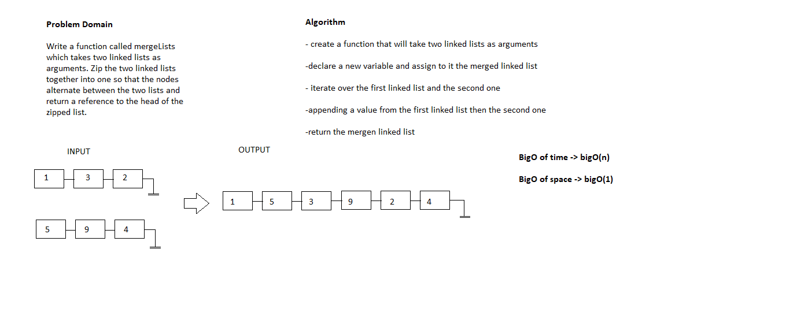

# Code Challenge 8

# Challenge Summary
<!-- Short summary or background information -->
- Write a function called mergeLists which takes two linked lists as arguments. Zip the two linked lists together into one so that the nodes alternate between the two lists and return a reference to the head of the zipped list

## Challenge Description
<!-- Description of the challenge -->
- Write a function called mergeLists which takes two linked lists as arguments. Zip the two linked lists together into one so that the nodes alternate between the two lists and return a reference to the head of the zipped list

## Approach & Efficiency
<!-- What approach did you take? Why? What is the Big O space/time for this approach? -->
- explained on whiteboatd

## Solution
