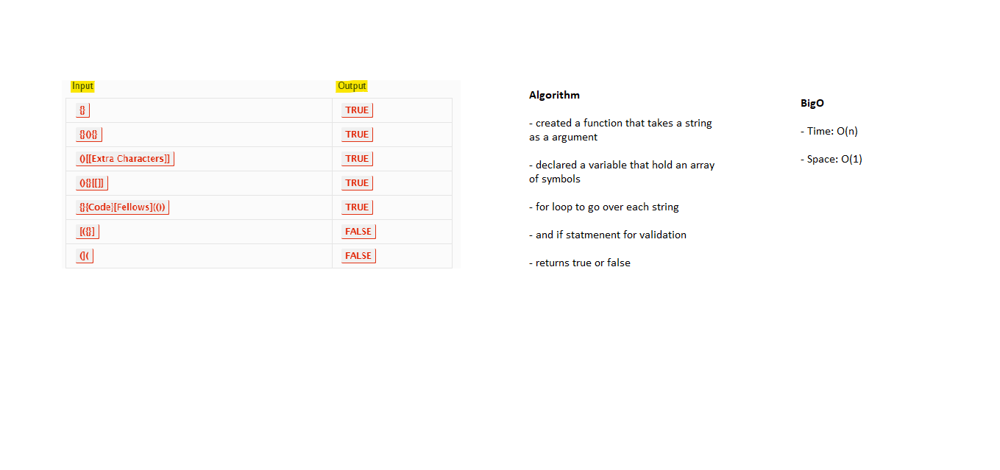

# Code Challenge 13

# Challenge Summary
- Multi-bracket Validation

## Challenge Description
- Create a function should take a string as its only argument, and should return a boolean representing whether or not the brackets in the string are balanced. There are 3 types of brackets:
- Round Brackets : \(\)
- Square Brackets : \[\]
- Curly Brackets : \{\}

## Approach & Efficiency 
- On the whiteboard

### The bigO
- On the whiteboard

## Solution
