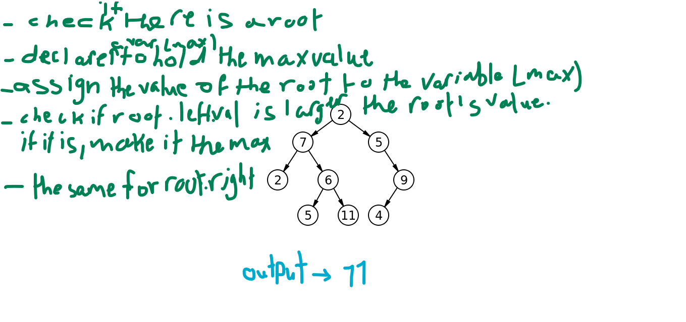

# Code Challenge 16

## Challenge Description
- Write an instance method called find-maximum-value. Without utilizing any of the built-in methods available to your language, return the maximum value stored in the tree. You can assume that the values stored in the Binary Tree will be numeric.

## Approach & Efficiency 
- On the whiteboard

### The bigO
- Time > BigO(n)
- Space > BigO(1)

## Solution
