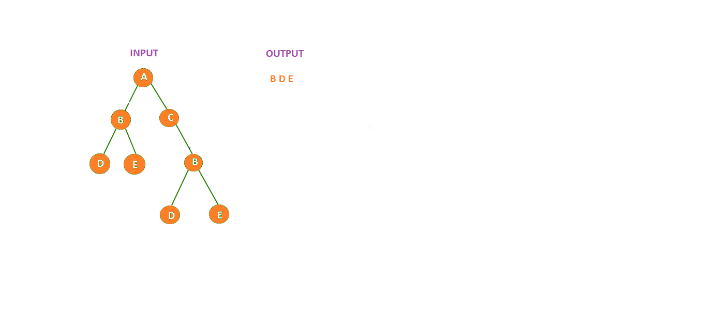

# Code Challenge 32

## Challenge Description
- Write a function called tree_intersection that takes two binary tree parameters, and returns a set of values found in both trees.

<!-- ## Approach & Efficiency 
- On the whiteboard

### The bigO
- On the whiteboard -->

## Solution
