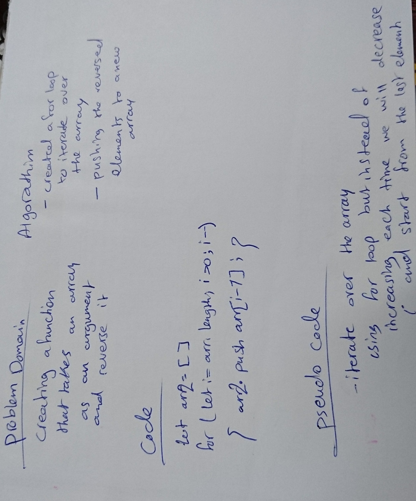

# Reverse an Array
<!-- Short summary or background information -->
I used an array method which is 'splice' that insert an element into an array .

## Challenge
<!-- Description of the challenge -->
The challenge was about creating a function which takes in an array and a value to be added in the middle index.

## Approach & Efficiency
<!-- What approach did you take? Why? What is the Big O space/time for this approach? -->
I used a method that mutates the array without the need to declaring a new one.

## Solution
<!-- Embedded whiteboard image -->
