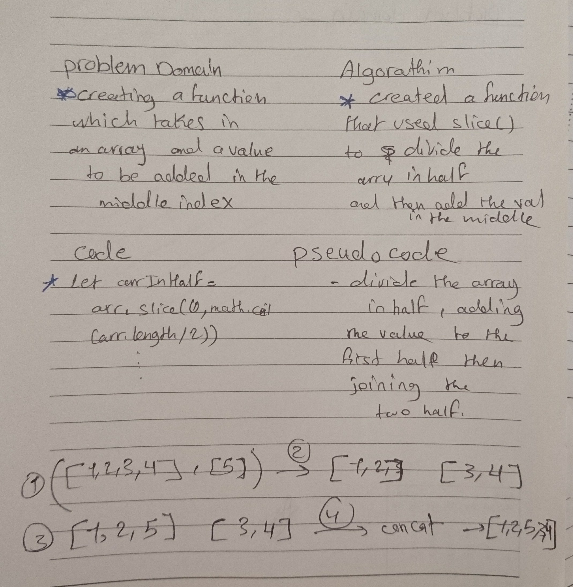

# Shift an Array
<!-- Short summary or background information -->
I used an array method which is 'slice' that returns an array by passing an argumant/s.

## Challenge
<!-- Description of the challenge -->
The challenge was about creating a function which takes in an array and a value to be added in the middle index.

## Approach & Efficiency
<!-- What approach did you take? Why? What is the Big O space/time for this approach? -->
I divided the array in half then I joined the two halfs by using concat

## Solution
<!-- Embedded whiteboard image -->

